# Mundo da Copa 26

Site independente para acompanhar a Copa do Mundo 2026 com calendário, classificação, estádios, convocações, simulador, Draft, Escudle, Futlike, blog editorial, notícias, placares em tempo real e estatísticas de partidas.

## Repositório showcase

Este repositório documenta publicamente o projeto **Mundo da Copa 26** como vitrine/case study.

O código-fonte principal não está disponível publicamente neste momento e não faz parte deste repositório.

## Site

https://www.mundodacopa.site

## Funcionalidades principais

- Home com destaques, ticker de jogos, rotas limpas e feed de notícias
- Calendário da Copa com filtros, busca e URLs compartilháveis
- Visualização dos 104 jogos do torneio
- Classificação por grupos, incluindo grupos A–L
- Guia dos 16 estádios da Copa
- Mapa interativo dos estádios
- Convocações e organização de jogadores por posição
- Histórico das seleções em Copas anteriores
- Dados por seleção: participações, títulos, melhor campanha, record geral, gols e artilheiros
- Simulador da Copa com fase de grupos e mata-mata
- Simulador respeita placares reais quando disponíveis, travando jogos já realizados
- Compartilhamento de cenários do simulador por link
- Draft Copa 2026: monte um XI com jogadores sorteados e tente vencer 8 jogos seguidos
- Reposicionamento de jogadores aptos no Draft
- Card PNG compartilhável do Draft
- Escudle: jogo diário de adivinhar escudos das seleções, com validação backend e histórico local
- Futlike: jogo estilo roguelite/manager com seleções desbloqueáveis, tiers, mapa de eventos, XP, energia, atributos e partidas simuladas
- Blog editorial com guias, artigos, categorias, busca e paginação
- Página de apoio ao projeto
- Atualização de placares reais via infraestrutura própria/cache
- Estatísticas de partidas em modal, incluindo placar, gols, eventos e dados do jogo quando disponíveis
- Rotas amigáveis e metadados por página para melhor experiência de compartilhamento
- Boas práticas públicas de segurança: HTTPS, headers de segurança, redirecionamento canônico e security.txt
- Estado da navegação na URL para facilitar compartilhamento
- Dark mode
- Design responsivo para desktop, tablet e mobile

## Screenshots

| Tela | Screenshot |
| --- | --- |
| Home | 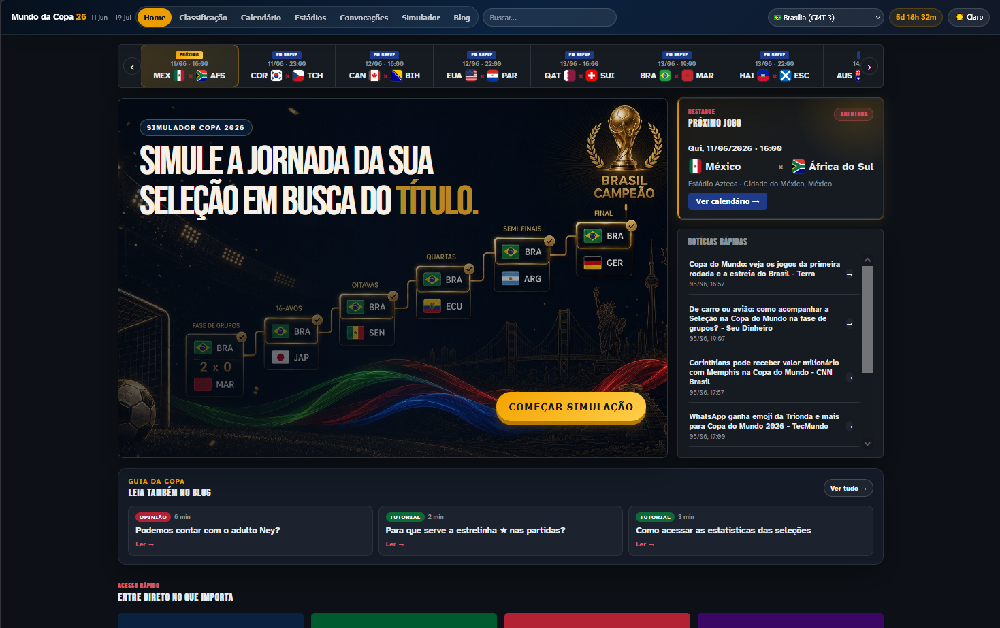 |
| Calendário | 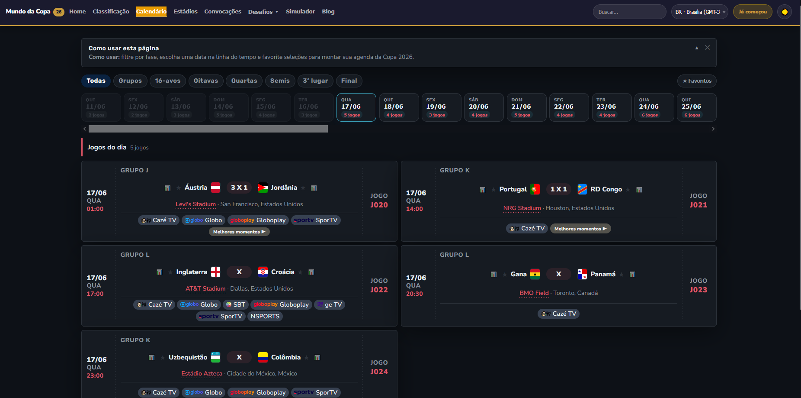 |
| Classificação | 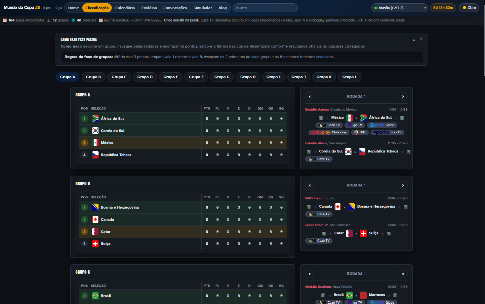 |
| Estádios | 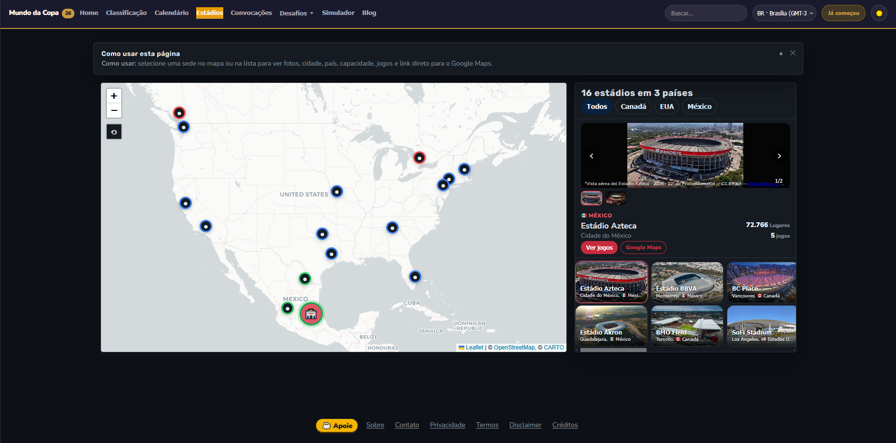 |
| Convocações | 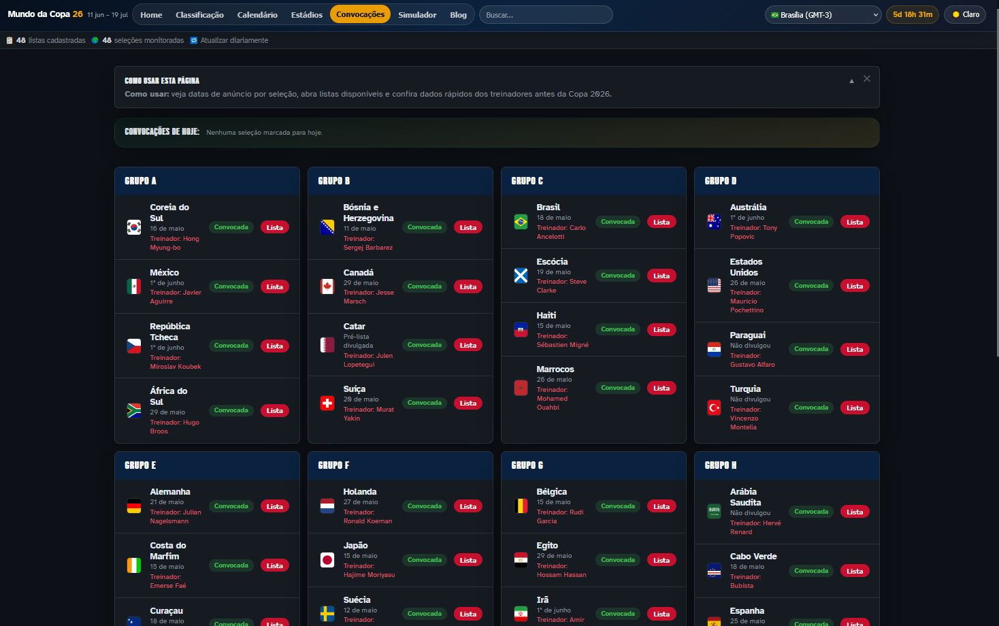 |
| Histórico das seleções | 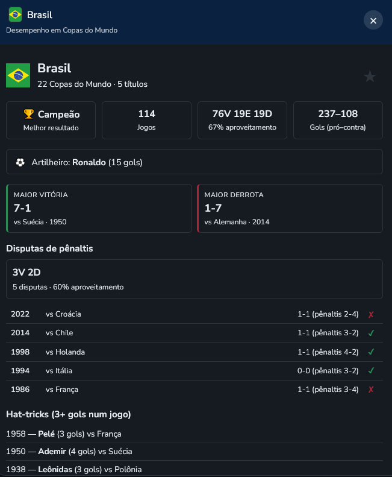 |
| Simulador | 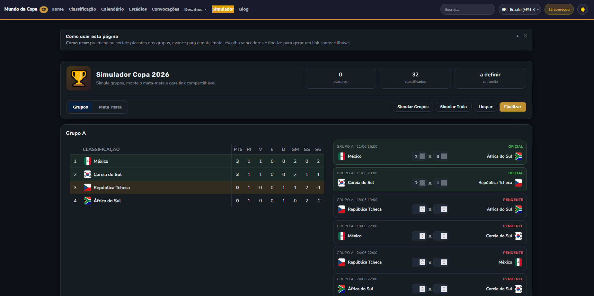 |
| Escudle | 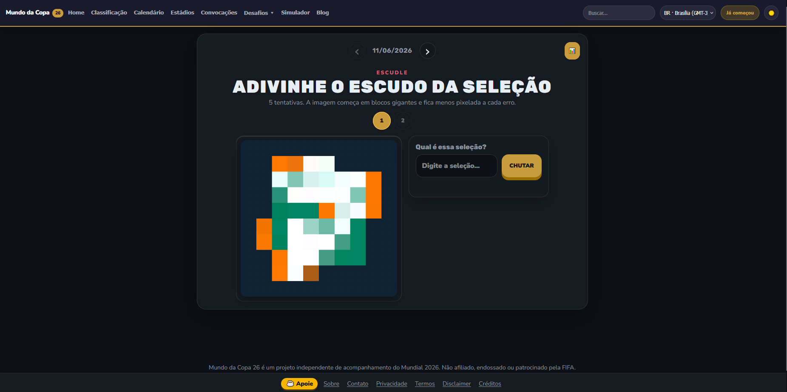 |
| Futlike — progresso | 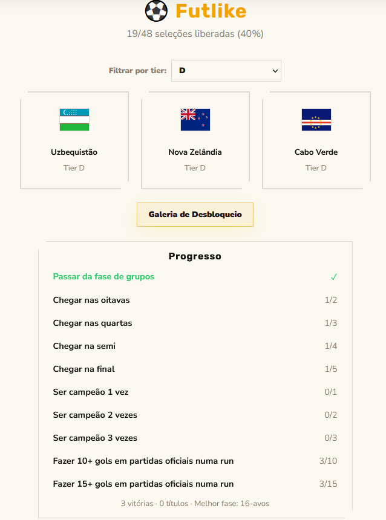 |
| Futlike — mapa | 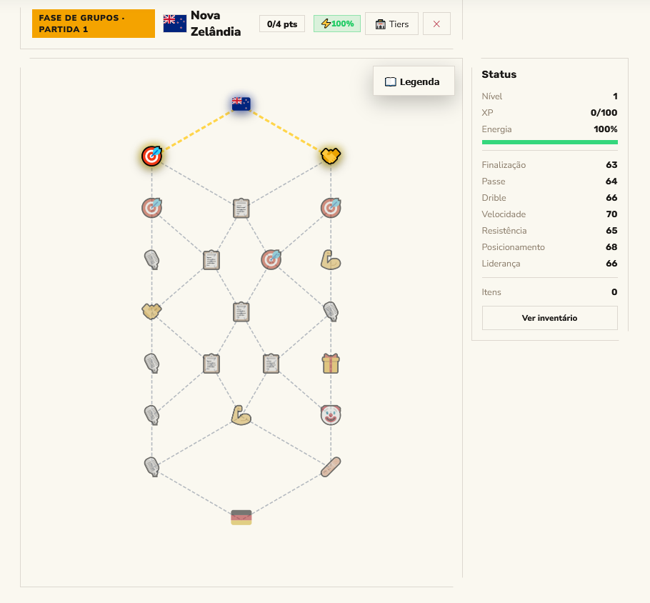 |
| Futlike — partida | 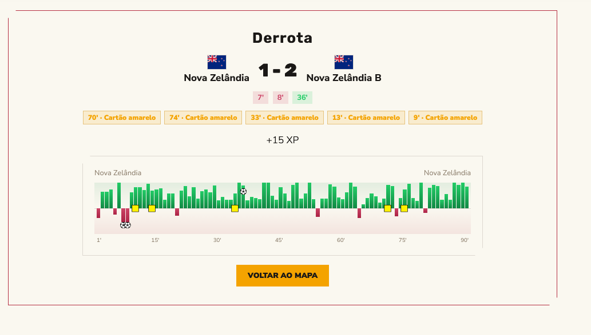 |
| 8 a 0 / Draft | 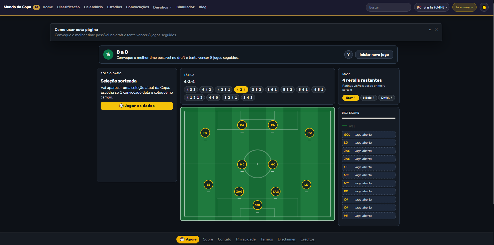 |
| Blog | 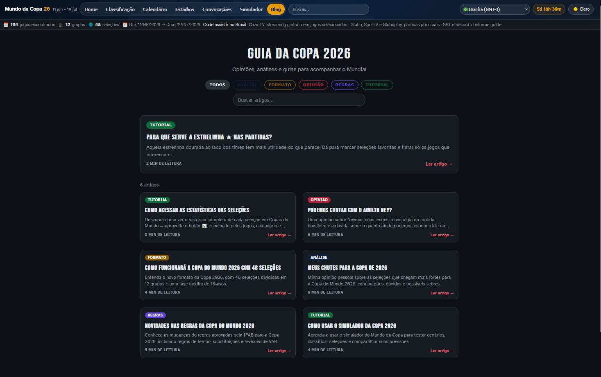 |

## Novidades recentes

- **Futlike** entrou no showcase como novo jogo interativo do projeto, com progressão, tiers, mapa de eventos e simulação de partidas.
- O showcase agora destaca melhor o conjunto de experiências de retenção: Escudle, Draft/8 a 0 e Futlike.
- A documentação pública segue sem expor código-fonte, regras internas ou detalhes sensíveis de infraestrutura.

## Jogos interativos

### Futlike

Jogo estilo roguelite/manager em que o usuário escolhe uma seleção, avança por um mapa de eventos e tenta evoluir durante uma campanha. A experiência combina seleções desbloqueáveis por tier, progresso persistente, XP, energia, atributos, inventário, eventos especiais e partidas simuladas com relatório de gols, cartões e pressão minuto a minuto.

### Escudle

Jogo diário de adivinhação de escudos. A cada rodada, um escudo de seleção é exibido com um filtro que reduz o número de candidatas possíveis. O jogador tem até 6 tentativas para acertar qual é a seleção, com dicas visuais progressivas (continente, cores, detalhes do escudo). O palpite é validado no backend para evitar consulta antecipada à resposta, e o progresso do dia fica salvo localmente, incentivando visitas diárias.

### 8 a 0 / Draft

Monte seu XI ideal com jogadores sorteados aleatoriamente e enfrente 8 partidas seguidas. A cada jogo, o time adversário evolui, e o jogador pode reposicionar atletas aptos dentro de posições compatíveis. O objetivo é vencer as 8 rodadas — um placar de 8 a 0 contra a máquina. O resultado final pode ser compartilhado como um card PNG estilizado.

## Tecnologias usadas

Visão em alto nível, sem detalhes sensíveis de infraestrutura:

- JavaScript, HTML e CSS
- Vite
- Leaflet para mapa interativo
- Cloudflare Pages
- Cloudflare Workers/Functions
- KV/cache para dados de placares
- Endpoints serverless para fluxos que exigem validação no servidor
- Worker agendado para atualização de placares e detalhes de partidas
- Base histórica pública da Copa do Mundo para histórico das seleções
- Playwright para testes end-to-end

## Status

Projeto em desenvolvimento ativo, com funcionalidades principais implementadas e evolução contínua de conteúdo editorial, experiência mobile, placares, jogos interativos e recursos de compartilhamento.

## Documentação

- [Visão geral do projeto](PROJECT_OVERVIEW.md)

## Disclaimer

O **Mundo da Copa 26** é um projeto independente e não possui afiliação com FIFA, confederações, seleções ou entidades oficiais.

## Código-fonte

Este repositório não contém o código-fonte principal do site, arquivos de configuração reais, secrets, dados privados, infraestrutura interna ou conteúdo operacional do projeto.
